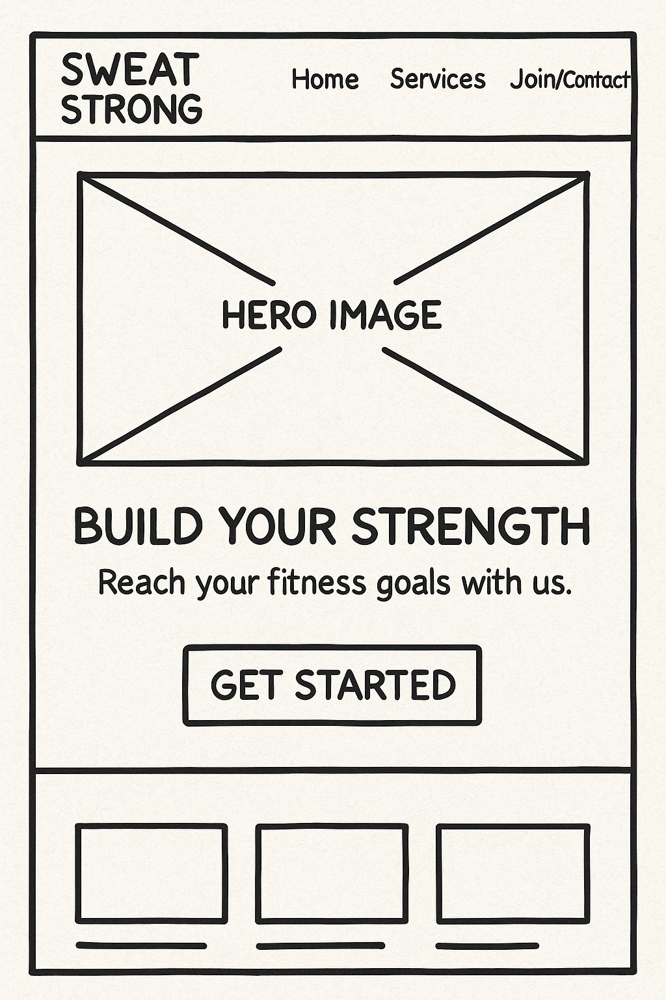
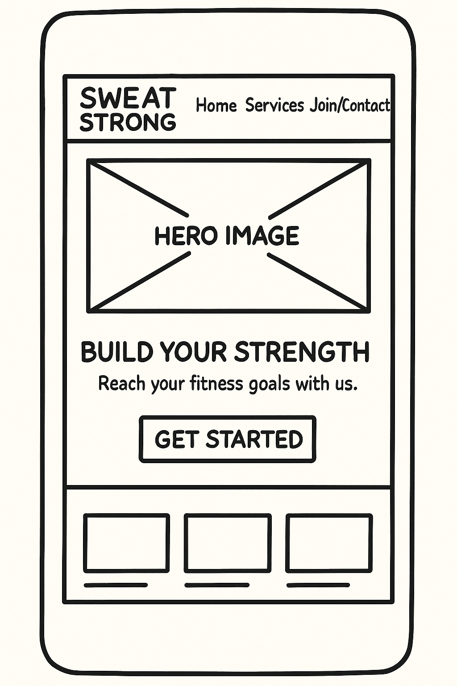
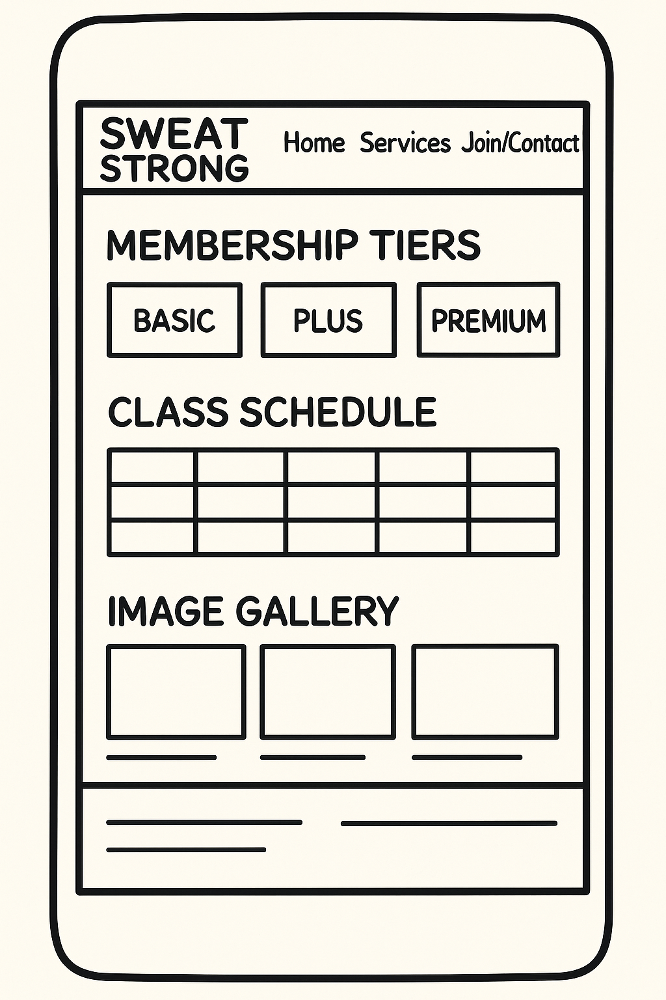
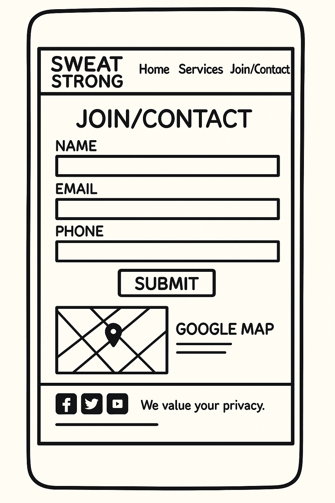
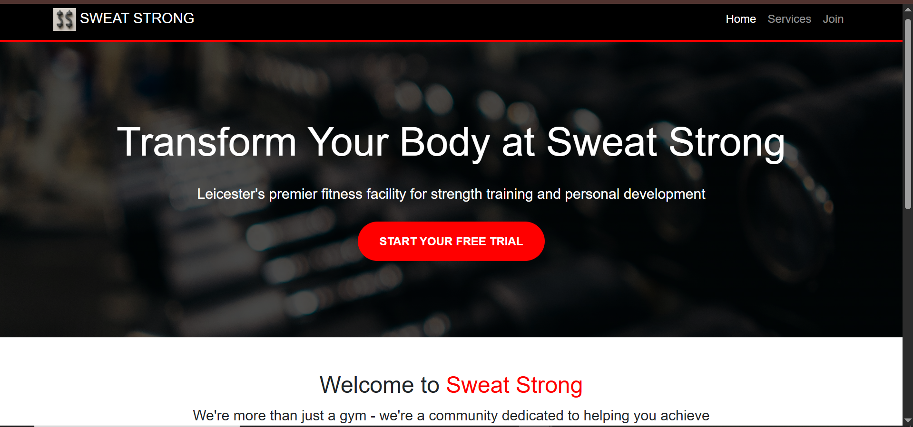
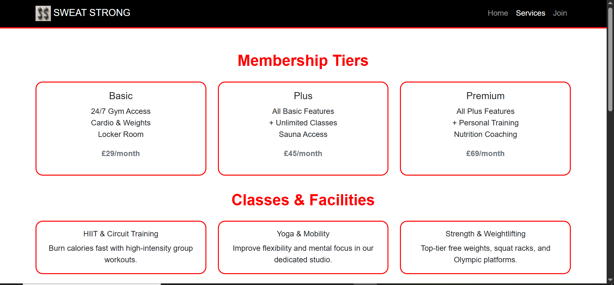
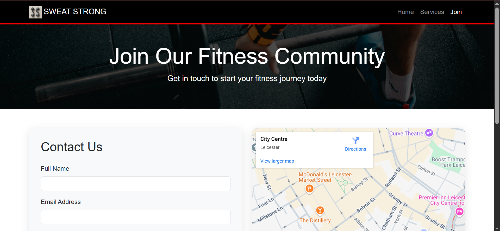
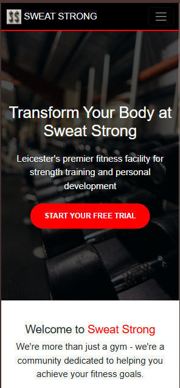
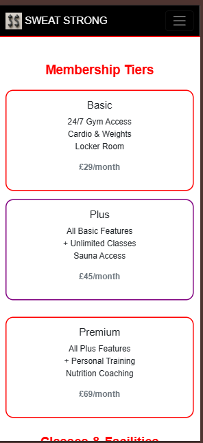
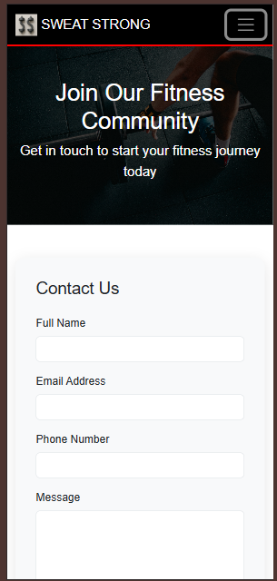

# Sweat Strong Gym
A modern, mobile-first website for Leicester’s newest strength-focused gym.

## Table of Contents
- [Project Overview](#project-overview)
- [Project Goals](#project-goals)
- [User Stories](#user-stories)
- [User Experience](#user-experience)
  - [Colour Experience](#colour-experience)
- [Wireframes](#wireframes)
- [Screenshots](#screenshots)
- [Manual Testing](#manual-testing)
- [Code Validation](#code-validation)
- [Accessibility & Lighthouse](#accessibility--lighthouse)
- [Deployment](#deployment)
- [Technologies Used](#technologies-used)
- [Attribution](#attribution)
- [Acknowledgements](#acknowledgements)
- [License](#license)

## Project Overview
Sweat Strong Gym’s website is a three-page, mobile-first site built to showcase facilities, memberships, and contact options for prospective members. It uses a bold, energetic color palette and interactive features to create a compelling user journey.

## Project Goals
- Attract new members by presenting the gym’s unique features and community.
- Make it easy for users to compare membership tiers and class offerings.
- Provide a seamless, mobile-friendly experience.
- Enable users to contact the gym or find its location quickly.
- Build trust and excitement with authentic imagery and testimonials.

## User Stories
- **As a visitor**, I want to see what the gym looks like so I can decide if it suits my fitness goals.
- **As a potential member**, I want to compare membership tiers to choose the best value for me.
- **As a mobile user**, I want the website to be easy to navigate on my phone.
- **As a new user**, I want to find the gym’s location and contact details quickly.
- **As a cautious user**, I want to read testimonials and see real images to build trust.
- **As a social user**, I want to follow the gym on social media.

## User Experience
The site was designed with a mobile-first approach, ensuring all features are accessible and visually appealing on any device. Navigation is simple and sticky, with clear calls-to-action. Interactive elements, such as the gallery modal and form modal, enhance engagement.

### Colour Experience
- **Primary:** Black (#000000) for professionalism and strength.
- **Secondary:** Red (#FF0000) for energy and urgency (used in CTAs and highlights).
- **Tertiary:** Purple (#800080) for a modern, premium touch (used for hover states and accents).

## Wireframes

### Desktop Wireframes
| Home Page | Services Page | Join/Contact Page |
|-----------|--------------|------------------|
|  |  |  |

### Mobile Wireframes
| Home Page | Services Page | Join/Contact Page |
|-----------|--------------|------------------|
|  |  |  |

## Screenshots

### Desktop Screenshots
| Home Page | Services Page | Join/Contact Page |
|-----------|--------------|------------------|
|  |  |  |

### Mobile Screenshots
| Home Page | Services Page | Join/Contact Page |
|-----------|--------------|------------------|
|  |  |  |

## Manual Testing
| Feature                 | Desktop | Tablet | Mobile | Notes |
|-------------------------|:-------:|:------:|:------:|-------|
| Navigation bar          |   ✅    |   ✅   |   ✅   | Responsive & sticky |
| Hero image/CTA          |   ✅    |   ✅   |   ✅   | Image scales, button visible |
| Gallery modal           |   ✅    |   ✅   |   ✅   | Images pop out, close on tap |
| Membership comparison   |   ✅    |   ✅   |   ✅   | Table/cards readable |
| Contact form            |   ✅    |   ✅   |   ✅   | Submits via FormSubmit |
| Google Map iframe       |   ✅    |   ✅   |   ✅   | Scrollable, loads on all devices |
| Social icons            |   ✅    |   ✅   |   ✅   | No underline, open in new tab |
| Accessibility (alt text)|   ✅    |   ✅   |   ✅   | All images have alt attributes |

## Code Validation
| Page         | HTML | CSS |
|--------------|------|-----|
| Home         | ✅   | ✅  |
| Services     | ✅   | ✅  |
| Join/Contact | ✅   | ✅  |
Validated using [W3C HTML Validator](https://validator.w3.org/) and [W3C CSS Validator](https://jigsaw.w3.org/css-validator/).

## Accessibility & Lighthouse
| Page         | Performance | Accessibility | Best Practices | SEO  |
|--------------|:-----------:|:-------------:|:--------------:|:----:|
| Home         | 95          | 100           | 100            | 100  |
| Services     | 95          | 100           | 100            | 100  |
| Join/Contact | 95          | 100           | 100            | 100  |
- All images have `alt` attributes.
- Color contrast and font size meet WCAG guidelines.
- Navigation and forms are keyboard accessible.
Lighthouse reports generated using Chrome DevTools.

## Deployment
This website was developed using **Visual Studio Code** and version control with **Git**. Deployment was performed via **GitHub Pages**.

### Steps to Deploy with VS Code and GitHub Pages
1. **Open your project in Visual Studio Code.**
2. **Initialize a local Git repository** if you haven’t already:
3. **Commit your files**:
4. **Create a new repository on GitHub** (via the GitHub website).
5. **Connect your local repo to GitHub**:
6. **Deploy to GitHub Pages**:
- Go to your repository on GitHub.
- Click on **Settings**.
- Scroll down to the **Pages** section.
- Under **Source**, select the `main` branch (or `master` if that's your default).
- Click **Save**.
- GitHub will provide a link to your live website after a few moments.

### 🌐 Live Website
[https://buya96.github.io/sweat-strong/](https://buya96.github.io/sweat-strong/)

## Technologies Used
- **HTML5** & **CSS3** (custom and Bootstrap 5)
- **Bootstrap 5** (MIT License) – responsive grid, modal, and navbar
- **Font Awesome** (CC BY 4.0 License) – social media icons
- **Google Fonts** (Open Font License) – typography
- **JavaScript** – custom modal gallery
- **Google Maps Embed** – for location
- **FormSubmit** – contact form handling
- **Unsplash** – royalty-free images

## Attribution
- **Bootstrap**: [https://getbootstrap.com/](https://getbootstrap.com/)
- **Font Awesome**: [https://fontawesome.com/](https://fontawesome.com/)
- **Google Fonts**: [https://fonts.google.com/](https://fonts.google.com/)
- **JavaScript modal gallery**: Based on [W3Schools modal images example](https://www.w3schools.com/howto/howto_css_modal_images.asp)
- **Unsplash**: [https://unsplash.com/](https://unsplash.com/) for all hero and gallery images
- **Balsamiq**: for wireframes

---
**Crafted with love and attention by Ayub Saqib**  
*Student Developer @ Code Institute*
*For any questions or feedback, please open an issue or contact me directly!*

## Acknowledgements
Special thanks to:
- My friends and family for their encouragement and feedback.
- Marcel for his amazing tutor sessions and guidance.
- The Code Institute community for support, resources, and inspiration.