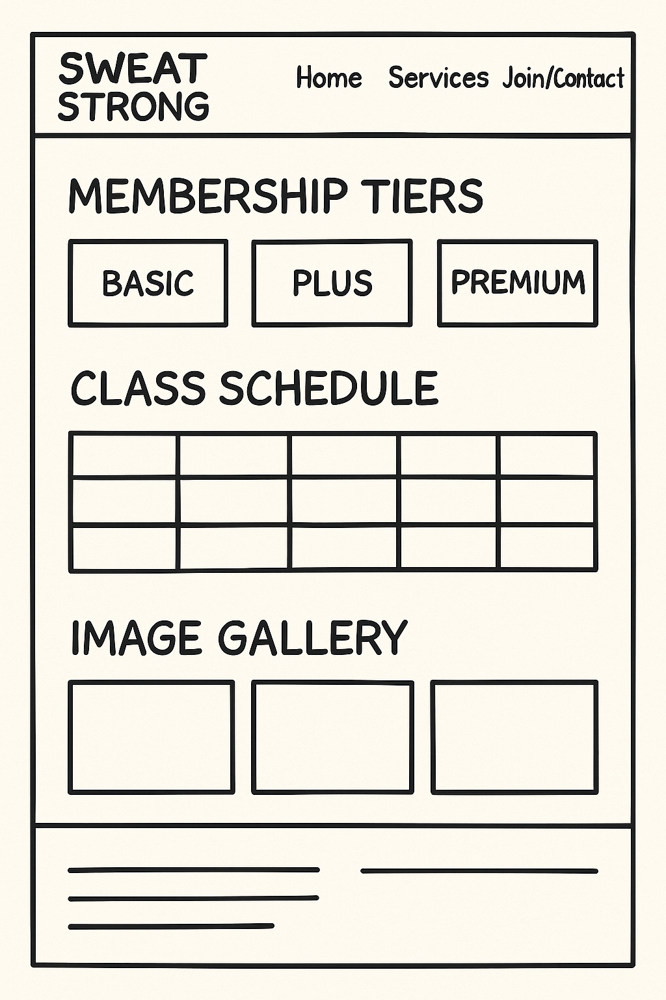
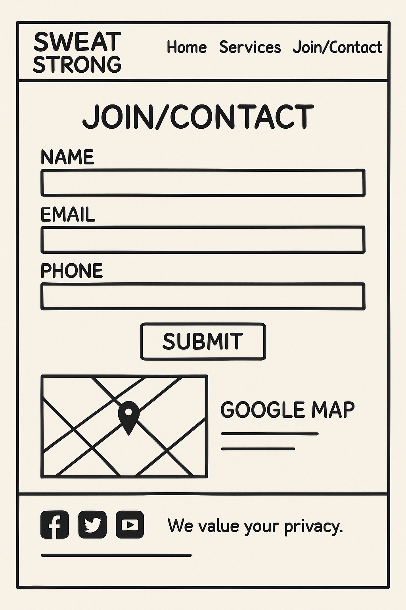

# Sweat Strong Gym Website  

[Sweat Strong Logo](assets/favicon/favicon-32x32.png)  
*A modern, mobile-first website for Leicester's newest strength-focused gym.*  

---

##  **Project Overview**  
This 3-page website showcases Sweat Strong Gym’s facilities, memberships, and contact details. Built with **Bootstrap 5**, it prioritizes user experience, accessibility, and conversion optimization.  

### Key Features:  
- Responsive design for all devices  
- Interactive gallery with image pop-out  
- Tiered membership comparisons  
- Contact form with Google Maps integration  
- Professional branding (black/red/purple theme)  

---
##  **Wireframes **  
 

| Page         | Wireframe Preview                              |  
|--------------|-----------------------------------------------|  
| Home         |  |  
| Services     |  |  
| Join/Contact |  |  

---
## 🌐 **Usage**  
- **Home Page:** Hero section with free trial CTA.  
- **Services Page:** Compare membership tiers, view class schedules, and explore the gallery.  
- **Join Page:** Submit inquiries via form or visit via embedded Google Maps.  

---
## 🔧 **Tech Stack & External Resources**  
| Tool/Resource       | Use Case                          | License/Attribution |  
|----------------------|-----------------------------------|---------------------|  
| Bootstrap 5          | Responsive layout & components    | [MIT License](https://github.com/twbs/bootstrap/blob/main/LICENSE)         |  
| Font Awesome         | Social media icons                | [CC BY 4.0 License](https://fontawesome.com/license)   |  
| Google Maps API      | Location embedding                | [Google Terms](https://developers.google.com/maps/terms)        |  
| FormSubmit           | Form handling (optional)          | Free Tier           |  
| Google Fonts         | Custom typography                 | [Open Font License](https://fonts.google.com/attribution) ([FAQ](https://developers.google.com/fonts/faq)) |  
| Unsplash Images      | Gallery & hero images             | [CC0 License](https://unsplash.com/license) |  

---

### **Design**  
- **Wireframes**: Created in Balsamiq ([Tutorial](https://balsamiq.com/tutorials/articles/first-wireframe/))  
- **Color Scheme**: Custom (black, red, purple)  

---
**Crafted with love and attention by Ayub Saqib**  
*Student Developer @ Code Institute*